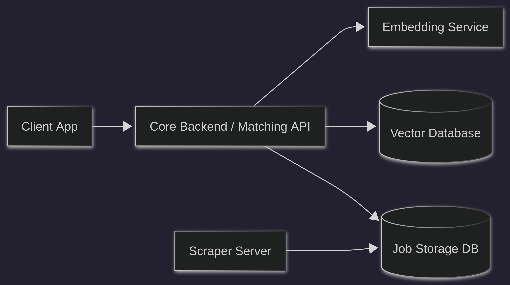
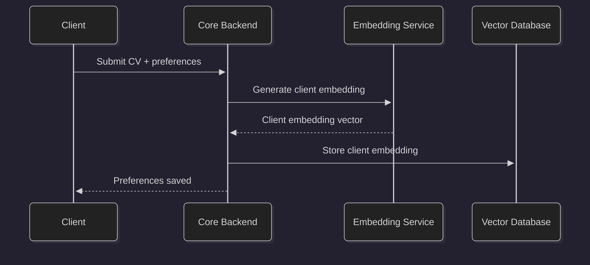
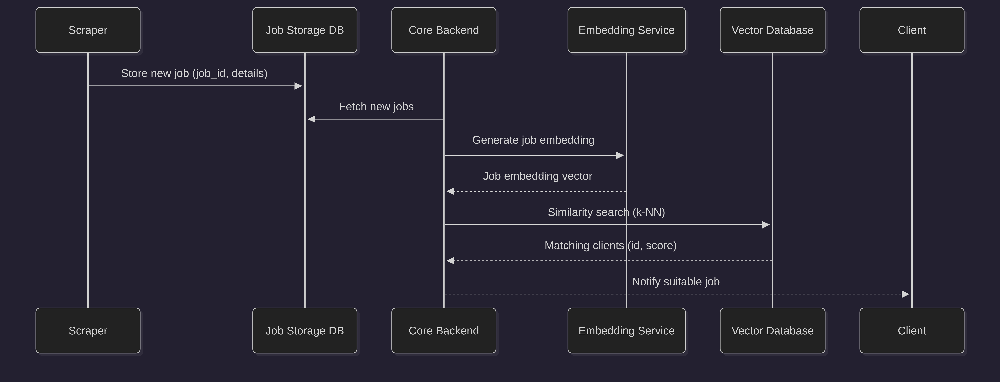
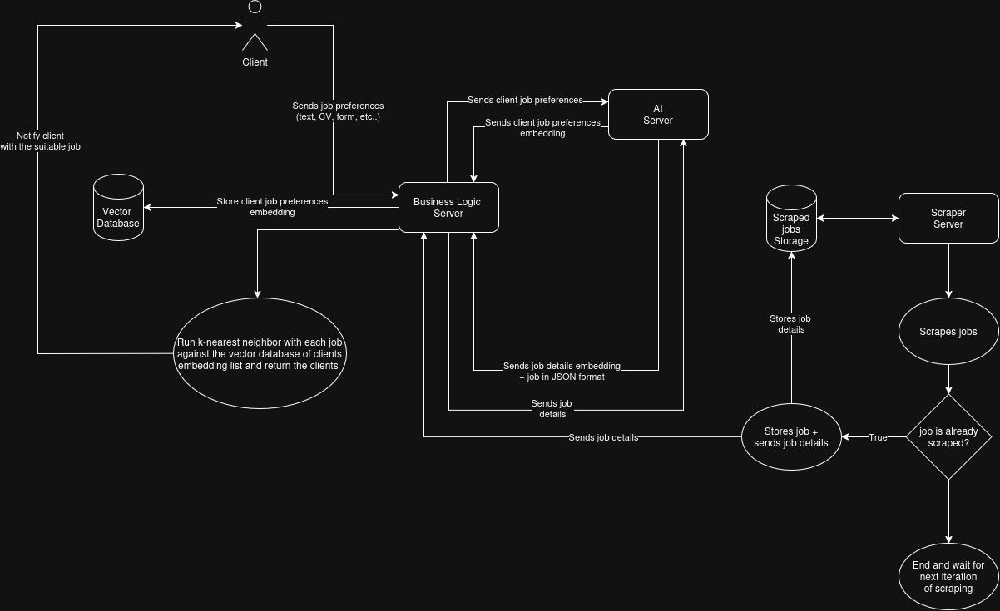

# System Design
This system uses:
- Vector embeddings for semantic job matching
- k-NN similarity search
- A decoupled scraping pipeline
- A dedicated embedding + LLM service

See diagrams below for detailed flows.

## System Architecture

## Client Onboarding Flow

## Job Matching Pipeline

## Detailed Design Overview
